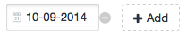

# Multidate - multiple dates field for Craft CMS #

Fieldtype that allows entering multiple dates.  
Because sometimes it takes more than one date.

## Features: ##
- Allows *unlimited* number of dates in one field.
- Can limit both minimum and/or maximum number of fields.
- Supports Import plugin. CSV data should be saved in YYYY-MM-DD,YYYY-MM-DD,... format (just a list of dates).

## Installation: ##
- Create "multidatefield" folder to your craft/plugins/ and copy files from this repository.
- Go to Settings > Plugins in Craft CP to install.

## How to use: ##
You can access field content in twig template via:
- `fieldname.json` (saved JSON data from db),
- `fieldname.dates` (array of saved dates).

## Examples/screenshots: ##
-   Both limits set to two (minimum and maximum number) - user cannot add or remove elements:  
    

-   No limits set - user can add or remove elements:  
    

## Todo:
- Ability to set input to required.
- Support for time and datetime.
- Better input template/js with reordering (reuse builtin Craft js?).

## Changelog ##

0.9:
- Initial release
